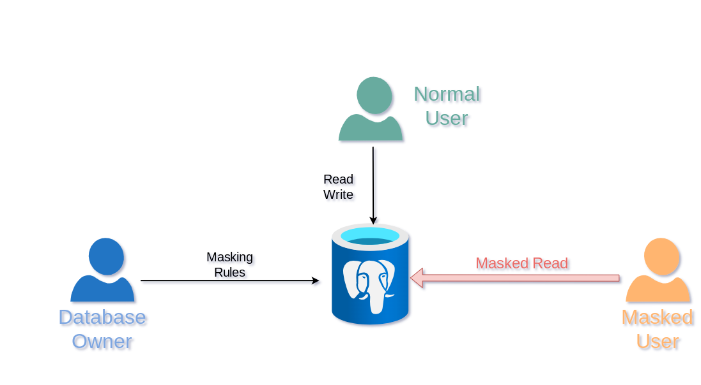

Anonymous Dumps
===============================================================================




Transparent Anonymous Dumps
------------------------------------------------------------------------------

To export the anonymized data from a database, follow these 3 steps:

### 1. Create a masked user

```sql
CREATE ROLE dump_anon LOGIN PASSWORD 'x';
ALTER ROLE dump_anon SET anon.transparent_dynamic_masking = True;
SECURITY LABEL FOR anon ON ROLE dump_anon IS 'MASKED';
```

__NOTE:__ You can replace the name `dump_anon` by another name.


### 2. Grant read access to that masked user

```sql
GRANT pg_read_all_data to dump_anon;
```

__NOTE:__ If you are running PostgreSQL 13 or if you want a more fine-grained
access policy you can grant access more precisely, for instance:


```sql
GRANT USAGE ON SCHEMA public TO dump_anon;
GRANT SELECT ON ALL TABLES IN SCHEMA public TO dump_anon;
GRANT SELECT ON ALL SEQUENCES IN SCHEMA public TO dump_anon;

GRANT USAGE ON SCHEMA foo TO dump_anon;
GRANT SELECT ON ALL TABLES IN SCHEMA foo TO dump_anon;
GRANT SELECT ON ALL SEQUENCES IN SCHEMA foo TO dump_anon;
```


### 3. Launch pg_dump with the masked user

Now to export the anonymous data from a database named `foo`, let's use
`pg_dump`:

```bash
pg_dump foo \
        --user dump_anon \
        --no-security-labels \
        --exclude-extension="anon" \
        --file=foo_anonymized.sql
```

__NOTES:__

* linebreaks are here for readability

* `--no-security-labels` will remove the masking rules from the anonymous dump.
  This is really important because masked users should not have access to the
  masking policy.

* `--exclude-extension` is only available with `pg_dump 17` and later.
  As an alternative you can use `--extension plpgsql`.

* `--format=custom` is supported


Anonymizing an SQL file
-----------------------------------------------------------------------------


[Install with docker]: INSTALL.md#install-with-docker

> In previous versions of the documentation, this method was also called
> « anonymizing black box ».

You can also apply masking rules directly on a database backup file !

The PostgreSQL Anonymizer docker image contains a specific entrypoint script
called `/dump.sh`. You pass the original data and the masking rules to
to that `/dump.sh` script and it will return an anonymized dump.

Here's an example in 4 steps:

_Step 1:_  Dump your original data (for instance `dump.sql`)

```console
pg_dump --format=plain [...] my_db > dump.sql
```

Note this method only works with plain sql format (`-Fp`). You **cannot**
use the custom format (`-Fc`) and the directory format (`-Fd`) here.

If you want to maintain the owners and grants, you need export them with
`pg_dumpall --roles-only` like this:

```console
(pg_dumpall -Fp [...] --roles-only && pg_dump -Fp [...] my_db ) > dump.sql
```

_Step 2:_  Write your masking rules in a separate file (for instance `rules.sql`)

```sql

SECURITY LABEL FOR anon ON COLUMN people.lastname
IS 'MASKED WITH FUNCTION anon.dummy_last_name()';

-- etc.
```

_Step 3:_  Pass the dump and the rules through the docker image and receive an
anonymized dump !

```console
IMG=registry.gitlab.com/dalibo/postgresql_anonymizer
ANON="docker run --rm -i $IMG /dump.sh"
cat dump.sql rules.sql | $ANON > anon_dump.sql
```

(this last step is written on 3 lines for clarity)

_NB:_ You can also gather _step 1_ and _step 3_ in a single command:

```console
(pg_dumpall --roles-only && pg_dump my_db && cat rules.sql) | $ANON > anon_dump.sql
```

__NOTES:__

You can use most the [pg_dump output options] with the `/dump.sh` script,
for instance:

```console
cat dump.sql rules.sql | $ANON --data-only --inserts > anon_dump.sql
```


[pg_dump output options]: https://www.postgresql.org/docs/current/app-pgdump.html#PG-DUMP-OPTIONS


DEPRECATED : pg_dump_anon
------------------------------------------------------------------------------

The `pg_dump_anon` command support most of the options of the regular [pg_dump]
command. The [PostgreSQL environment variables] ($PGHOST, PGUSER, etc.) and
the [.pgpass] file are also supported.

[PostgreSQL environment variables]: https://www.postgresql.org/docs/current/libpq-envars.html
[.pgpass]: https://www.postgresql.org/docs/current/libpq-pgpass.html


### Example

A user named `bob` can export an anonymous dump of the `app` database like
this:

```bash
pg_dump_anon -h localhost -U bob --password --file=anonymous_dump.sql app
```

**WARNING**: The name of the database must be the last parameter.

For more details about the supported options, simply type `pg_dump_anon --help`


### Install With Go

```console
go install gitlab.com/dalibo/postgresql_anonymizer/pg_dump_anon
```

### Install With docker

If you do not want to install Go on your production servers, you can fetch the
binary with:

```console
docker run --rm -v "$PWD":/go/bin golang go get gitlab.com/dalibo/postgresql_anonymizer/pg_dump_anon
sudo install pg_dump_anon $(pg_config --bindir)
```


### Limitations

* The user password is asked automatically. This means you must either add
  the `--password` option to define it interactively or declare it in the
  [PGPASSWORD] variable or put it inside the [.pgpass] file ( however on
  Windows,the [PGPASSFILE] variable must be specified explicitly)

* The `plain` format is the only supported format. The other formats (`custom`,
  `dir` and `tar`) are not supported


[PGPASSWORD]: https://www.postgresql.org/docs/current/libpq-envars.html
[PGPASSFILE]: https://www.postgresql.org/docs/current/libpq-envars.html
